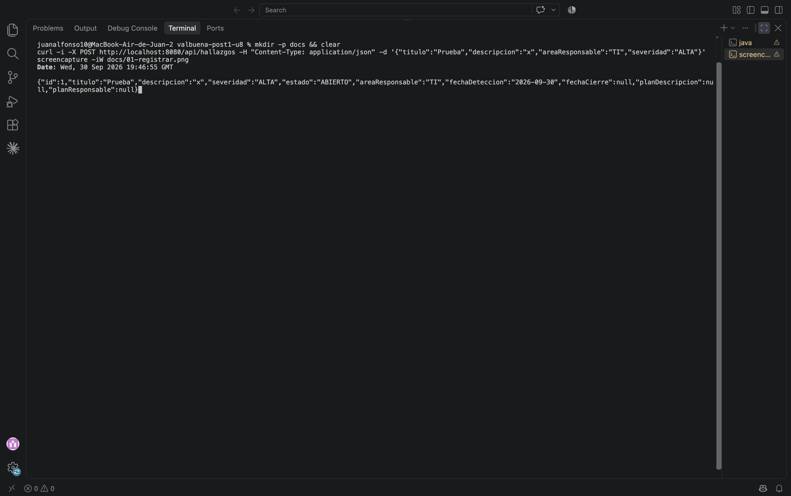
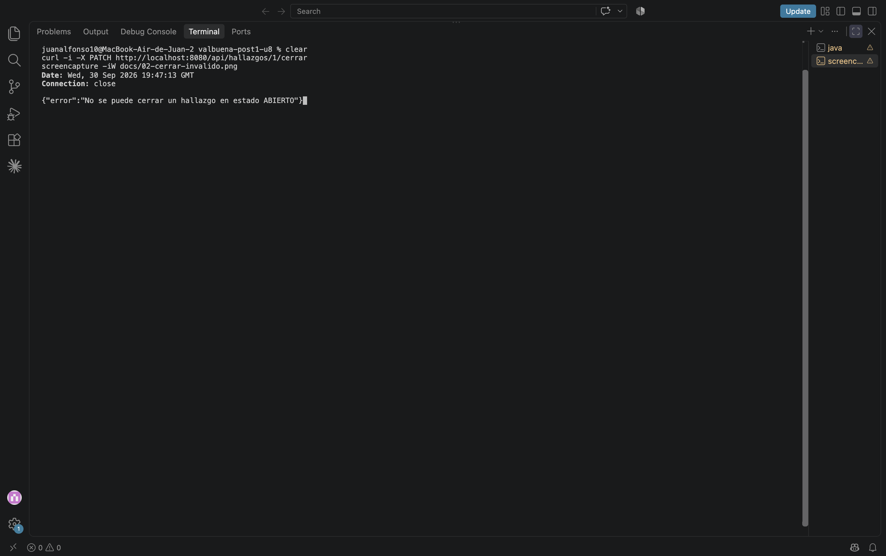
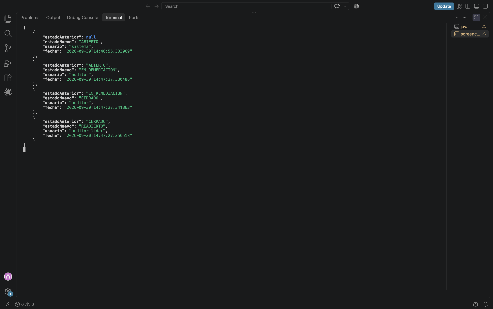
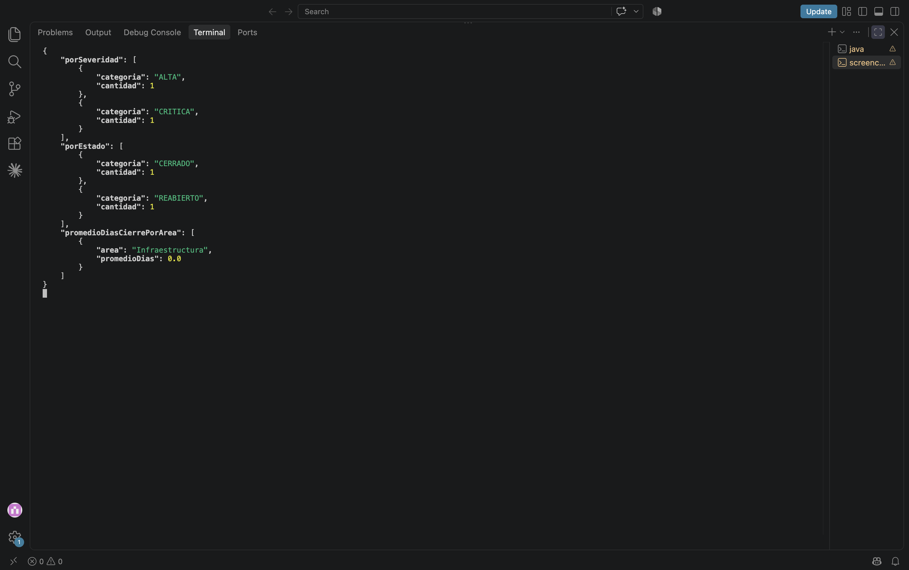

# Post-contenido — Unidad 8: Patrones Arquitectónicos II

## Descripción
Repositorio del post-contenido de la Unidad 8 de Patrones de Diseño de Software. Sistema de seguimiento de hallazgos de auditoría interna implementado con Clean Architecture (Parte 1) y extendido con un dashboard agregado y una bitácora de trazabilidad de cambios de estado (Parte 2), sobre el mismo proyecto Spring Boot.

## Parte 1 — Clean Architecture (Hallazgos de Auditoría)

El proyecto organiza sus componentes en los cuatro círculos concéntricos. La dependencia del código siempre apunta hacia adentro, hacia `domain/`:

- **Entities (`domain/`)**: el Aggregate Root `HallazgoAuditoria`, los Value Objects `HallazgoId`, `PlanRemediacion` y `Severidad`, y el enum con máquina de estados `EstadoHallazgo`. No importa ningún framework (ni `org.springframework` ni `jakarta.persistence`), por lo que se prueba con JUnit puro (`HallazgoDomainTest`).
- **Use Cases (`usecase/`)**: interfaces de los casos de uso, puertos de salida (`HallazgoRepositoryPort`, `HistorialAuditoriaPort`) e implementaciones en `impl/`. No depende de Spring ni de los adaptadores.
- **Interface Adapters (`adapter/`)**: adaptador de entrada `HallazgoController` con sus DTOs, y adaptadores de salida `HallazgoRepositoryAdapter` e `HistorialAuditoriaAdapter`, que traducen entre el dominio y las entidades JPA.
- **Frameworks & Drivers (`config/` + Spring Boot, JPA, H2)**: `AuditoriaConfiguration` hace el wiring explícito de los casos de uso y define los límites transaccionales.

### Estructura de paquetes

```
src/main/java/com/example/auditoria/
├── domain/                               ← Entities
│   ├── entity/HallazgoAuditoria.java
│   └── valueobject/
│       ├── EstadoHallazgo.java
│       ├── HallazgoId.java
│       ├── PlanRemediacion.java
│       ├── Severidad.java
│       └── TransicionInvalidaException.java
├── usecase/                              ← Use Cases
│   ├── RegistrarHallazgoUseCase.java
│   ├── IniciarRemediacionUseCase.java
│   ├── CerrarHallazgoUseCase.java
│   ├── ReabrirHallazgoUseCase.java
│   ├── ConsultarHallazgoUseCase.java
│   ├── ObtenerDashboardAuditoriaUseCase.java    (Parte 2)
│   ├── ConsultarHistorialUseCase.java           (Parte 2)
│   ├── port/
│   │   ├── HallazgoRepositoryPort.java          (extendido en Parte 2)
│   │   ├── HistorialAuditoriaPort.java          (Parte 2)
│   │   ├── ConteoCategoria.java, PromedioCategoria.java
│   │   └── DashboardAuditoriaView.java, CambioEstadoView.java
│   └── impl/
│       ├── *Service.java                        (lógica de cada caso de uso)
│       └── *ConHistorial.java                   (decoradores de bitácora, Parte 2)
├── adapter/                              ← Interface Adapters
│   ├── in/web/HallazgoController.java + dto/
│   └── out/persistence/
│       ├── HallazgoJpaEntity.java, HallazgoJpaRepository.java
│       ├── HallazgoRepositoryAdapter.java
│       ├── HistorialCambioEstadoEntity.java, HistorialCambioEstadoJpaRepository.java
│       └── HistorialAuditoriaAdapter.java
├── config/AuditoriaConfiguration.java    ← Frameworks & Drivers (wiring + transacciones)
└── AuditoriaHallazgosApplication.java
```

## Parte 2 — Análisis costo-beneficio de CQRS y Event Sourcing

Antes de implementar, se evaluaron los dos nuevos requisitos (dashboard consolidado y trazabilidad legal) con los criterios de las Secciones 4.4, 5.5 y 7 de la guía.

**1. Escala y carga.** Es un sistema académico desarrollado por una sola persona, sin usuarios concurrentes reales; en un escenario productivo equivalente lo usaría un comité de auditoría pequeño que consulta el dashboard una vez al mes. No existe una asimetría de escala entre lecturas y escrituras: ambas son esporádicas y de bajo volumen. Separar la infraestructura de lectura (otra base de datos o réplica) no aporta rendimiento medible y sí añade costo de operación.

**2. Complejidad de las consultas.** El dashboard necesita conteos por severidad, conteos por estado y el promedio de días de cierre por área. Las tres son agregaciones simples (`COUNT`, `AVG` con `GROUP BY`) sobre una sola tabla, `hallazgos`, resueltas con JPQL y proyecciones de Spring Data sobre el mismo esquema. No hay joins costosos, ni desnormalización necesaria, ni una forma de lectura que el modelo de escritura no pueda servir. Un modelo de lectura con tecnología distinta no se justifica.

**3. Consistencia.** El comité revisa el dashboard antes de cada reunión mensual. Lo esperable es que refleje el estado al momento de la consulta, como cualquier reporte generado bajo demanda, y eso es exactamente lo que ofrece consultar el mismo esquema. CQRS completo, además, introduciría consistencia eventual entre el modelo de escritura y el de lectura: un problema que hoy no existe y que habría que gestionar sin ningún beneficio para el usuario.

**4. Naturaleza de la trazabilidad exigida.** Cumplimiento necesita reconstruir cronológicamente cada cambio de estado (quién, cuándo, de qué estado a cuál) y que ese registro no se pueda alterar. No necesita reconstruir el **estado** del hallazgo reproduciendo eventos uno a uno, ni consultar estados intermedios, ni alimentar proyecciones futuras desconocidas. Por lo tanto basta una bitácora cronológica append-only que coexista con el estado actual ya persistido; Event Sourcing obligaría a reescribir la persistencia del agregado para que se reconstruya por replay en cada lectura.

**5. Señales de sobre-ingeniería (Sección 7.2).** Se revisaron las tres señales de la guía:
- *Experto de negocio para modelar eventos:* no existe; el comité y Cumplimiento son ficticios y sus requisitos están completamente especificados, sin ambigüedad que un modelado de eventos deba resolver.
- *Experiencia del equipo con Event Sourcing:* el equipo es una sola persona sin experiencia previa en producción con Event Store, versionado de eventos o snapshots, que son justamente las fuentes de complejidad descritas en la Sección 5.5.
- *Proporcionalidad del costo:* dos modelos separados, un Event Store y proyecciones asíncronas multiplicarían el número de clases y puntos de falla para resolver tres consultas `GROUP BY` y un historial. El costo no es proporcional al problema.

**Conclusión del análisis:** CQRS y Event Sourcing completos **no se justifican** en este contexto. Se implementó una extensión liviana: los métodos de agregación se añadieron al mismo `HallazgoRepositoryPort` (sin stack de lectura separado) y la trazabilidad se resolvió con una tabla de historial append-only escrita en la misma transacción que cada transición.

## Decisiones de diseño

1. **`Severidad` como enum simple vs. `EstadoHallazgo` como enum con máquina de estados.** `EstadoHallazgo` encapsula una regla de negocio real: qué transiciones son válidas (`ABIERTO → EN_REMEDIACION → CERRADO → REABIERTO → EN_REMEDIACION`). Por eso tiene el método `puedeTransicionarA(...)` y el agregado lanza `TransicionInvalidaException` si se viola. `Severidad` es solo una clasificación: ninguna severidad restringe a otra ni cambia con el tiempo, así que darle comportamiento sería añadir código sin regla que proteger. Modelar ambos igual habría sido o sobrecargar `Severidad` o dejar la máquina de estados fuera del dominio.

2. **`PlanRemediacion` como Value Object embebido vs. agregado separado.** La invariante "un hallazgo no puede pasar a `EN_REMEDIACION` sin plan válido ni cerrarse sin uno definido" debe cumplirse siempre, sin ventanas de inconsistencia. Según el criterio de **límite de consistencia transaccional** de agregados (Sección 3.3 de la guía), todo lo que participa en una misma invariante debe vivir dentro del mismo agregado y guardarse en una sola transacción. Si el plan fuera un agregado aparte con su propio repositorio, existiría un momento en que el hallazgo estaría en remediación sin plan persistido. Además, el plan no tiene identidad propia ni ciclo de vida independiente: es un Value Object inmutable.

3. **Extensión del repositorio existente vs. CQRS completo.** Aplicando los criterios de escala, complejidad de consultas y consistencia (Secciones 4.4 y 7), `HallazgoRepositoryPort` se extendió con `contarPorSeveridad()`, `contarPorEstado()` y `calcularPromedioDiasPorArea()`. `HallazgoRepositoryAdapter` los resuelve delegando en consultas JPQL con proyecciones de `HallazgoJpaRepository`, sobre el mismo esquema. El caso de uso `ObtenerDashboardAuditoriaService` depende solo del puerto, nunca de JPA, por lo que la regla de dependencia se mantiene intacta.

4. **Bitácora simple (`HistorialCambioEstado`) vs. Event Store completo.** Siguiendo las señales de sobre-ingeniería de la Sección 7.2 (sin experto en eventos, sin experiencia previa en Event Sourcing, costo desproporcionado), se implementó una tabla `historial_cambios_estado` append-only: `HistorialAuditoriaPort` solo expone `registrar` y `listarPorHallazgo`, sin operaciones de actualización ni borrado. El estado actual sigue viviendo en `HallazgoJpaEntity`; el historial nunca se usa para reconstruirlo. El registro se hace con **decoradores** de los casos de uso (`*ConHistorial`), que envuelven a los servicios originales sin modificarlos (principio abierto/cerrado). `AuditoriaConfiguration` envuelve cada caso de uso de transición en un `TransactionTemplate`, de modo que el cambio de estado y su registro en la bitácora se confirman o revierten juntos, en la misma transacción, sin introducir anotaciones de Spring en el círculo de Use Cases.

## Cómo ejecutar

```bash
mvn clean package
mvn spring-boot:run
```

La aplicación queda en `http://localhost:8080`. Pruebas rápidas:

```bash
curl -i -X POST http://localhost:8080/api/hallazgos -H "Content-Type: application/json" \
  -d '{"titulo":"Prueba","descripcion":"x","areaResponsable":"TI","severidad":"ALTA"}'
curl -i -X PATCH http://localhost:8080/api/hallazgos/1/cerrar
curl -X PATCH http://localhost:8080/api/hallazgos/1/iniciar-remediacion -H "Content-Type: application/json" \
  -d '{"descripcion":"Rotar credenciales","responsable":"Infra","fechaCompromiso":"2026-10-20"}'
curl -X PATCH http://localhost:8080/api/hallazgos/1/cerrar
curl -X PATCH http://localhost:8080/api/hallazgos/1/reabrir -H "Content-Type: application/json" -d '{"motivo":"reaparecio"}'
curl http://localhost:8080/api/hallazgos/1/historial
curl http://localhost:8080/api/hallazgos/dashboard
```

## Evidencias

**Registro de un hallazgo (201 Created)**


**Cierre sin plan de remediación rechazado (400 Bad Request)**


```
HTTP/1.1 400
{"error":"No se puede cerrar un hallazgo en estado ABIERTO"}
```

**Historial cronológico tras el ciclo completo**


```json
[
  {"estadoAnterior":null,"estadoNuevo":"ABIERTO","usuario":"sistema"},
  {"estadoAnterior":"ABIERTO","estadoNuevo":"EN_REMEDIACION","usuario":"auditor"},
  {"estadoAnterior":"EN_REMEDIACION","estadoNuevo":"CERRADO","usuario":"auditor"},
  {"estadoAnterior":"CERRADO","estadoNuevo":"REABIERTO","usuario":"auditor-lider"}
]
```

**Dashboard consolidado**


## Herramientas utilizadas
- Java 17, Spring Boot 3.2, Spring Data JPA, H2
- Apache Maven, curl, Git, GitHub

## Conclusiones
Clean Architecture permitió que el dominio (máquina de estados, invariantes del plan de remediación) se probara con JUnit puro y que la Parte 2 se incorporara solo con nuevos puertos, adaptadores y decoradores, sin modificar las entidades. El análisis costo-beneficio mostró que requisitos que "suenan" a CQRS o Event Sourcing pueden resolverse con proyecciones sobre el mismo esquema y una bitácora append-only cuando la escala, la complejidad de las consultas y la experiencia del equipo no justifican más. Se reconsideraría **CQRS** si el volumen de lecturas del dashboard creciera hasta competir con las escrituras, o si aparecieran consultas que exigieran otra tecnología (búsqueda de texto completo, analítica histórica pesada). Se reconsideraría **Event Sourcing** si Cumplimiento pidiera reconstruir el estado completo del hallazgo en cualquier fecha pasada, auditar cambios de campos además del estado, o si surgieran varias proyecciones nuevas alimentadas por los mismos eventos.
